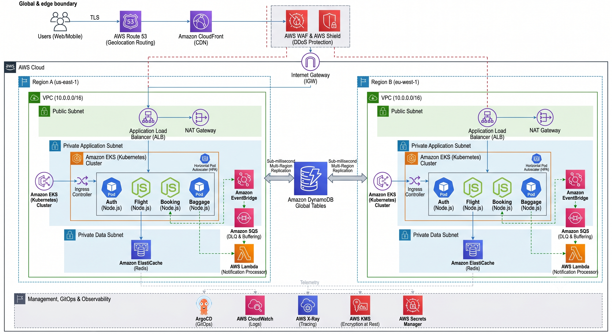

# ✈️ AeroLink Airline Systems


> An enterprise-grade, cloud-native microservices platform designed for global aviation operations. Built with a focus on **Active-Active multi-region high availability**, **distributed data consistency**, and **event-driven architecture**.

## 🏗️ Architectural Overview



AeroLink transitions legacy airline systems into a modern, decoupled cloud ecosystem. The platform utilizes **Amazon EKS** for compute orchestration, **DynamoDB Global Tables** for multi-region state, and **AWS EventBridge** for asynchronous message routing. 

### Core Engineering Features
- **Distributed Data Consistency:** Implementation of the **Saga Pattern** with compensating transactions to ensure booking integrity without strict ACID database locks.
- **Extreme Fault Tolerance:** Validated to survive simulated 48,000-user DDoS attacks (1,329 req/sec) using **API Gateway Rate Limiting** and downstream **Circuit Breakers**.
- **Real-Time Synchronisation:** Zero-latency seat availability and baggage updates pushed to clients via **API Gateway WebSockets**.
- **Zero-Trust Security:** End-to-end TLS 1.3, AWS KMS encryption at rest, and strict **JWT / RBAC** authentication.
- **GitOps CI/CD:** Fully automated deployment pipeline utilizing **GitHub Actions** and **ArgoCD**.

---

## ⚙️ Core Technology Stack

| Layer | Technologies | Justification |
| :--- | :--- | :--- |
| **Backend Compute** | Node.js (Express), AWS Lambda | High-concurrency non-blocking I/O; Serverless execution. |
| **Databases & Caching**| Amazon DynamoDB, Redis (ElastiCache)| Multi-region replication; Sub-millisecond read caching. |
| **Messaging & Events** | AWS EventBridge, Amazon SQS, WebSockets | Decoupled asynchronous communication and real-time updates. |
| **Infrastructure (IaC)** | HashiCorp Terraform, Docker, Amazon EKS | Declarative infrastructure; infinite horizontal pod auto-scaling. |
| **Security & Routing** | AWS API Gateway, AWS KMS, JWT | Zero-trust authentication, edge rate-limiting, and encryption. |
| **Observability** | AWS CloudWatch, AWS X-Ray | Centralized JSON logging and distributed microservice tracing. |
| **CI/CD & Testing** | GitHub Actions, ArgoCD, Jest, Artillery | Pull-based GitOps deployment; extreme stress testing. |
| **API Documentation**| Swagger (OpenAPI) | Live, interactive contract testing. |

---

## 🧩 Microservices Topology

The platform consists of strictly decoupled domain services communicating asynchronously:

| Service | Port | Domain Responsibility |
|---------|------|-------------|
| **Auth Service** | 4001 | Authentication, JWT token issuance, identity management. |
| **Flight Service** | 4002 | Global flight search, seat mapping, and scheduling. |
| **Booking Service** | 4003 | Reservation coordination, payment processing, Saga orchestrator. |
| **Baggage Service** | 4004 | RFID baggage tracking and real-time status updates. |
| **Docs Service** | 4000 | Centralized Swagger / OpenAPI documentation host. |
| **Notification Service**| Lambda | Event-driven passenger alerts (Email/SMS) via EventBridge. |

---

## 🚀 Quick Start (Local Development)

### Prerequisites
- Node.js >= 22.0.0
- Docker & Docker Compose
- AWS CLI configured

### Local Spin-Up
To run the entire microservices mesh locally for testing:
```bash
# Clone the repository
git clone <repository-url>
cd AeroLink_Airline_Systems

# Copy environment variables for all services
cp services/auth-service/.env.example services/auth-service/.env
cp services/flight-service/.env.example services/flight-service/.env
cp services/booking-service/.env.example services/booking-service/.env
cp services/baggage-service/.env.example services/baggage-service/.env

# Build and start all containers
docker-compose up --build

# Access Swagger API Documentation
http://localhost:4000/api-docs
```

---

## ☁️ AWS Infrastructure Deployment (Terraform)

The entire AWS footprint is codified using HashiCorp Terraform for reproducible deployments across environments.

```bash
cd terraform

# Initialize providers
terraform init

# Review the infrastructure plan
terraform plan -var-file="environments/dev.tfvars"

# Provision the AWS infrastructure
terraform apply -var-file="environments/dev.tfvars"
```

---

## 🧪 Testing & Validation

```bash
# Execute the comprehensive Jest unit testing suite
npm test

# Run tests for isolated microservices
cd services/booking-service && npm test
```

## 📜 License
This project is licensed under the MIT License.
